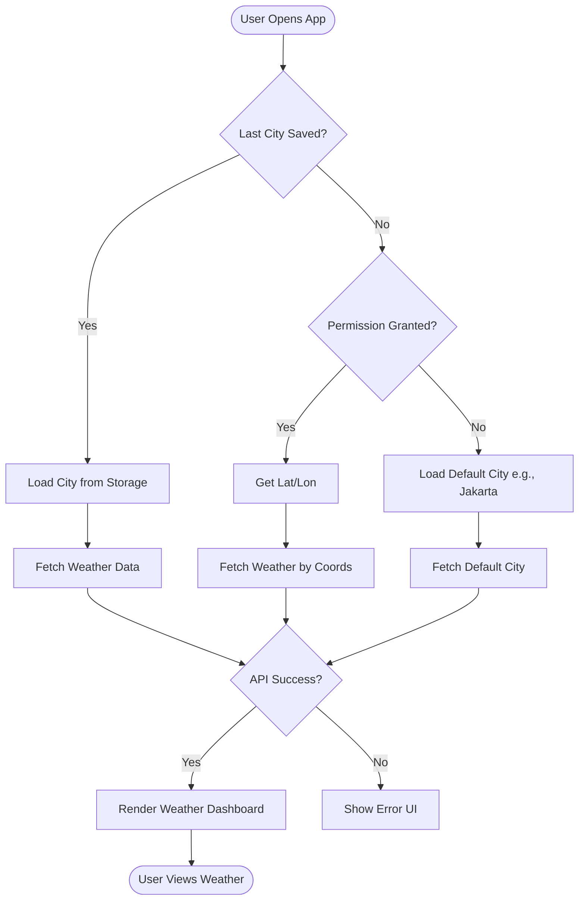
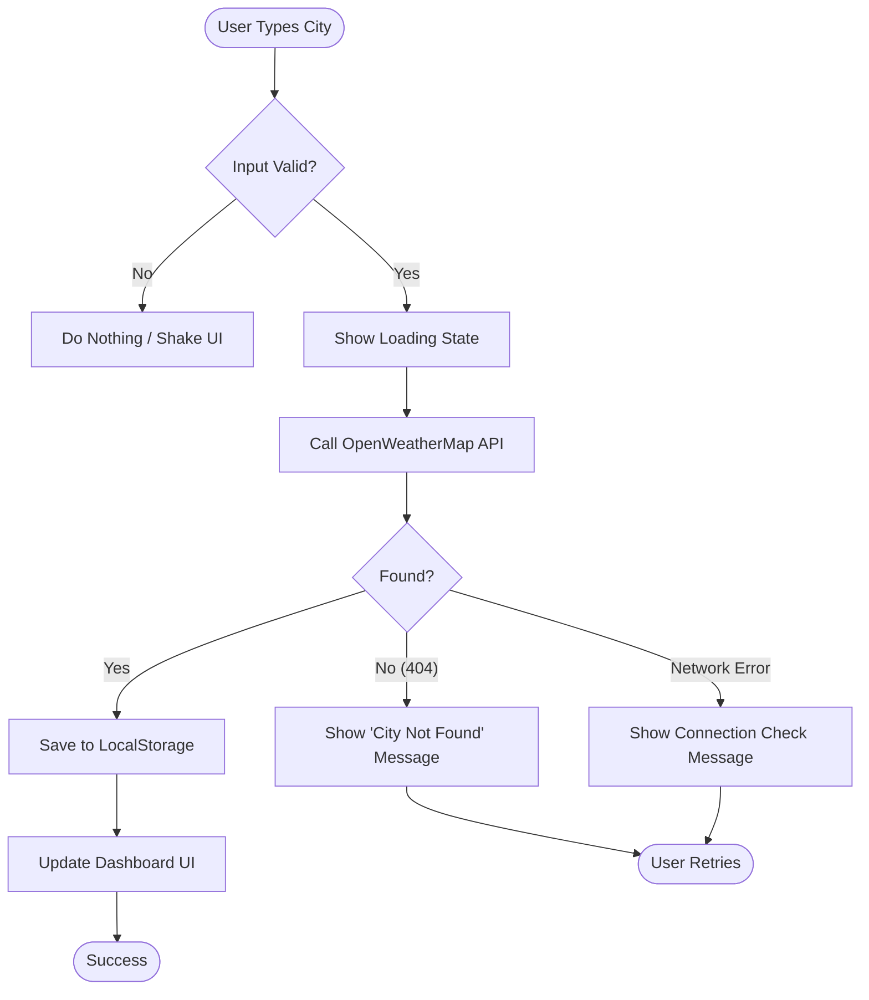
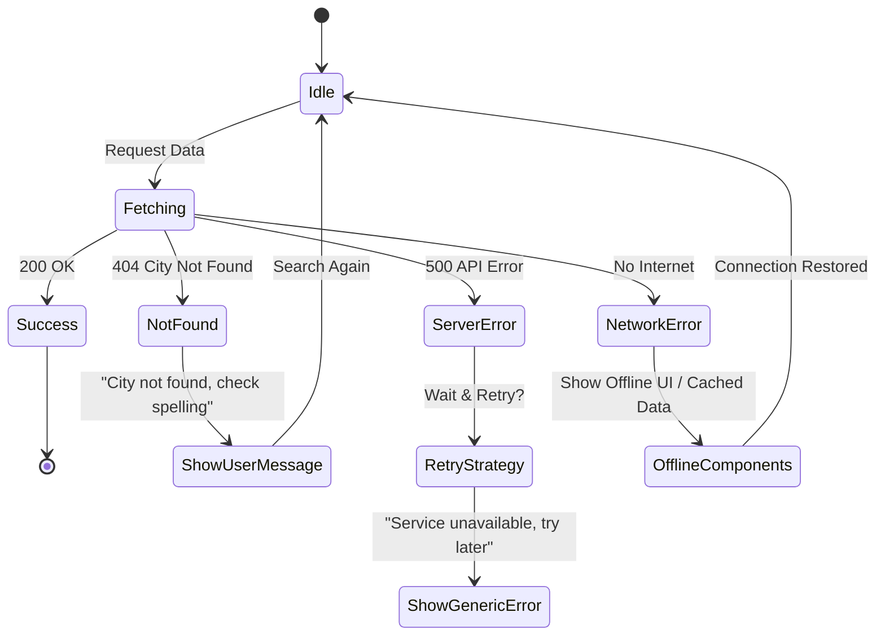

# Weather Dashboard User Flows

This document maps out the core user interactions and logic flows for the application.

## 1. App Initialization & Geolocation Flow

When the user first opens the application.

## 2. Search City Flow

When the user manually searches for a specific location.

## 3. Error Handling Logic

Detailed breakdown of how different errors are handled.

